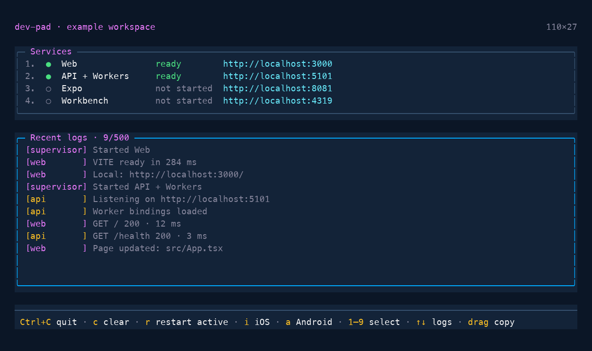
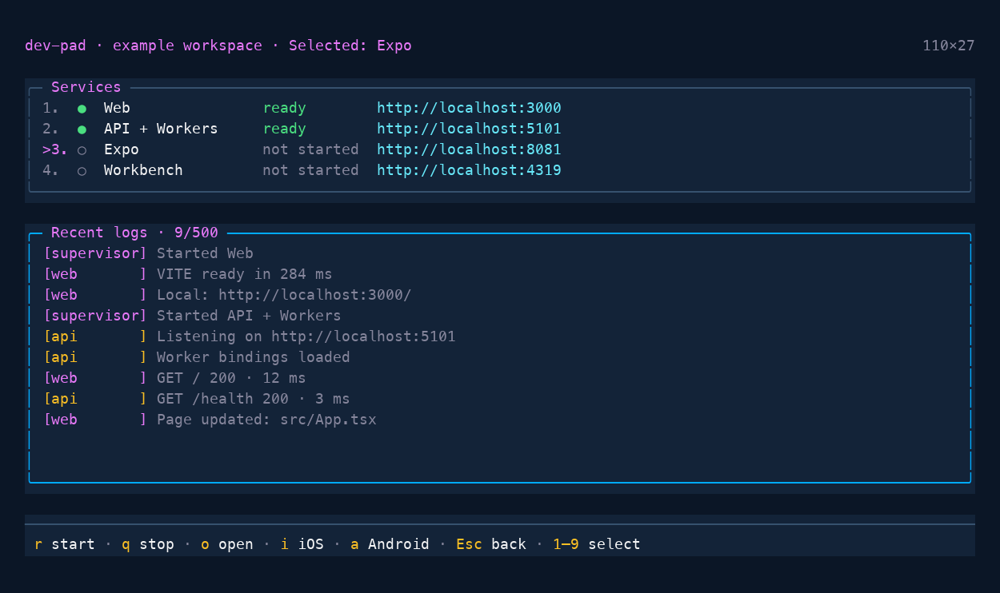

# dev-pad

[](LICENSE)
[](https://www.npmjs.com/package/dev-pad)
[](https://github.com/Censkh/dev-pad/actions/workflows/ci.yml)

One terminal for your local services. Start, restart, and stop processes; follow their
logs; and add project-specific actions using a small TypeScript config.

Works with **Node, Bun, and Deno**. The commands `dev-pad`, `devpad`, and `dpad` are aliases.

## Install and try it

Install in your project:

```sh
npm install --save-dev dev-pad
```

Add a `dev-pad.config.ts` using the configuration below, then run `npx dev-pad`.
To try the standalone example first:

```sh
git clone https://github.com/Censkh/dev-pad.git
cd dev-pad
bun install --frozen-lockfile
bun run example:start
```

The [example project](example/README.md) starts a local website and API, with an
optional background worker. No external services are needed. Press `1` then `s`
to switch sites, or `3` then `r` to start the worker. `Ctrl+C` quits.



*Overview with an illustrative Expo configuration and a custom navy theme: running and optional services,
shared logs, and top-level actions.*

## Use in your project

After stopping the example, link the built package into your project:

```sh
# From the dev-pad repository:
bun link
cd ../your-project
bun link dev-pad
```

In your project, create `dev-pad.config.ts`. Replace the commands and ports below
with your project's existing dev commands:

```ts
import { defineConfig } from "dev-pad";

export default defineConfig({
  title: "My project",
  services: [
    {
      id: "web",
      name: "Web",
      command: ["bun", "run", "dev:web"],
      port: 3000,
      url: "http://localhost:3000",
    },
    {
      id: "api",
      name: "API",
      command: ["bun", "run", "dev:api"],
      port: 3001,
      url: "http://localhost:3001/health",
      probe: "http",
    },
  ],
});
```

Run `dev-pad`, or add `"dev": "dev-pad"` to your project's package scripts.
Use `dev-pad --check` to validate the config without starting services.

The aliases use Node. To choose a runtime explicitly from your project directory:

```sh
node ../dev-pad/dist/cli.js
bun ../dev-pad/dist/cli.js
deno run -A ../dev-pad/dist/cli.js
```

Service commands are independent of the dashboard runtime: a Node dashboard can
launch Bun, Deno, Docker, or any other executable.

## Keyboard controls

Press a service's number to select it. **Selection does not start or restart it.**
The highlighted row and action bar show which service you are controlling.



*Selecting Expo shows its actions. Escape clears the selection; numbers switch services.*

| Key | No service selected | Service selected |
| --- | --- | --- |
| `1`–`9` | Select a service | Select another service |
| `r` | Restart active services | Start or restart this service |
| `q` | No action | Stop this service |
| `o` | No action | Open this service's URL, if configured |
| `Esc` | No action | Return to the top level |
| `Ctrl+C` | Quit and stop services | Quit and stop services |
| `c` | Clear logs | Clear logs |
| `↑` / `↓` | Scroll logs | Scroll logs |

While a service is selected, the action bar shows **its actions**, **Esc** to clear
the selection, and **1–9** to select another service. Global log and quit shortcuts
still work, but their hints are hidden. Selection
remains after an action. Windows also supports the Ctrl+Break signal for quitting.
With Bun, drag to select and copy log text.

A service that has never started displays **not started**. After it has run and
stopped, it displays **stopped**. Health checks update running services' status.

## Custom actions and live status

Put service-specific actions on that service. Set `global: true` to also expose
an action at the top level. It remains hidden and disabled when a different
service is selected. For example, these Expo actions appear at the top level
and when Expo is selected:

```ts
import { defineConfig, type ServiceContext } from "dev-pad";

async function launch(ctx: ServiceContext, platform: "ios" | "android") {
  ctx.service("mobile").command = ["bun", "run", "expo", `run:${platform}`];
  await ctx.restart("mobile");
}

export default defineConfig({
  title: "My mobile project",
  status: () => [{ label: "Environment", value: "local", tone: "info" }],
  services: [
    {
      id: "mobile",
      name: "Expo",
      cwd: "packages/app",
      command: ["bun", "run", "expo", "start"],
      port: 8081,
      url: "http://localhost:8081",
      autostart: false,
      terminal: true,
      actions: [
        { key: "i", label: "iOS", global: true, run: ctx => launch(ctx, "ios") },
        { key: "a", label: "Android", global: true, run: ctx => launch(ctx, "android") },
      ],
    },
  ],
});
```

Use `config.actions` for dashboard-wide actions, such as regenerating shared files.
These appear only at the top level. Keys must be unique within each scope;
global action keys must also be unique together. `q` and `c` are reserved.
Custom actions may override the default `r` or `o` behavior in their scope.

Both `config.status()` and `service.status()` return live items with `label`,
`value`, and an optional `tone`: `muted`, `info`, `success`, `warning`, or `danger`.
Use `config.tick(ctx)` for periodic asynchronous work rather than doing I/O in
`status()`. For site switching, an action can update shared state, while `url`,
`env`, and `status` functions read it on demand.

## Configuration reference

Each service needs a unique `id`, a `name`, and a `command` or `start` hook.
Commands are argument arrays and do not run through a shell automatically.

| Option | Behavior |
| --- | --- |
| `command` | Executable and arguments for the long-running process |
| `cwd` | Working directory, relative to the project directory |
| `env` | Extra environment variables, or a function returning them; inherits the current environment |
| `url` | URL string or function; enables the selected service's open action |
| `port` | Checks for an occupied port before startup; supplies a TCP health check |
| `probe` | `"http"` checks the URL, or supply an async function returning a boolean |
| `autostart` | Defaults to enabled; set `false` to start manually |
| `dependsOn` | Service IDs to start first and stop last |
| `terminal` | Enable a Bun PTY for interactive subprocess input on supported platforms |
| `start(ctx)` | Async setup before launching `command`, or a custom lifecycle without a command |
| `stop(ctx)` | Async cleanup after terminating the process |
| `actions` / `status()` | Custom keyboard actions and live status items |
| `allowOccupiedPort` | Skip the startup port conflict check, e.g. for an existing Docker service |

The CLI defaults the project directory to the config's directory; `config.cwd`
overrides it. Direct calls to `runDashboard(config)` or `createDashboard(config)`
default to the current working directory.

Dependencies finish their start hooks before dependents launch; this does **not**
wait for their health probes to become ready. A dependency starts even if it has
`autostart: false`. Put required readiness waits in its start hook. HTTP health
checks accept responses below 500 and time out after 900 ms.

For Docker or other external resources, use `start` and `stop` hooks with
`ctx.run(...)`. Define cleanup explicitly: stopping a Docker CLI process alone
does not stop its containers. Shutdown stops dependents before dependencies.
On POSIX, dev-pad terminates managed process groups and escalates to SIGKILL after
2.5 seconds. Windows currently terminates direct children only.

If a port is occupied on POSIX, dev-pad uses `lsof` to reclaim a listener only when
its working directory belongs to this project. Other occupied ports fail startup.

### Action context

| Method | Purpose |
| --- | --- |
| `ctx.start(id)` / `ctx.stop(id)` / `ctx.restart(id)` | Control a service |
| `ctx.restartAll()` | Restart active services, preserving dependency order |
| `ctx.service(id)` | Read or change a service's config before restarting it |
| `ctx.open(url)` | Open an HTTP(S) URL in the default browser |
| `ctx.run(command, options?)` | Run a utility, wait for completion, and return captured output; nonzero exits reject |
| `ctx.log(source, message)` | Append a message to shared logs |
| `ctx.write(id, input)` | Send input to a running service; returns false if it is not running |

`ctx.run` options are `source`, `cwd`, `env`, and `quiet`. Set `quiet: true` to
capture utility output without adding it to the dashboard's logs.

## Runtime and CLI options

| Runtime | Interactive renderer | Subprocess input |
| --- | --- | --- |
| Node 22+ | Portable terminal UI | Pipes |
| Bun 1.3+ | OpenTUI | Pipes, or PTY when `terminal: true` is supported |
| Deno 2.1.5+ | Portable terminal UI | Pipes |

Node loads TypeScript configs through `tsx`; Bun and Deno load them natively.
Use explicit `.ts` extensions for local config imports when running with Deno.
The Deno command uses `-A` for subprocess, environment, file, and network access.

| Flag | Behavior |
| --- | --- |
| `--config path` | Load a specific config |
| `--check` | Load and validate the config without starting services |
| `--plain` | Print prefixed logs without the interactive UI |
| `--help` / `--version` | Print usage or version |

The CLI searches for `dev-pad.config.ts`, `.mts`, `.js`, then `.mjs` in the current
directory. Configs execute code when imported, including with `--check`.
Redirected input or output automatically selects plain logging. Logs retain the
latest 500 entries and collapse repeated carriage-return spinner frames.

## Contributing

```sh
bun install --frozen-lockfile
bun run check:fix
bun run build
bun run check:example
npm test
npm run test:example
```

`check` and `check:fix` typecheck first, then run Biome. Rebuild after source edits
to update linked projects. For the other runtimes and real terminal tests:

```sh
bun test/smoke.mjs && bun test/lifecycle.mjs
deno task test
python3 test/ui.py
```

The terminal tests require Python 3 on POSIX, plus the runtimes under test. Run
`python3 test/ui.py bun` (or `node` / `deno`) to test one renderer.
GitHub CI checks and builds once, then tests Node 22/24/26, Bun 1.3/latest, and
Deno 2.1.5/latest, including keyboard input, rendering, and process cleanup.

[Changelog](CHANGELOG.md) · [MIT license](LICENSE).
